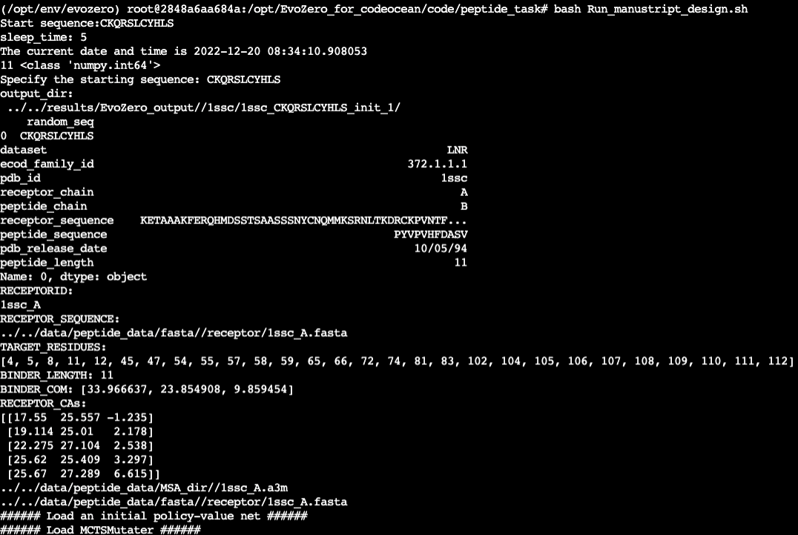
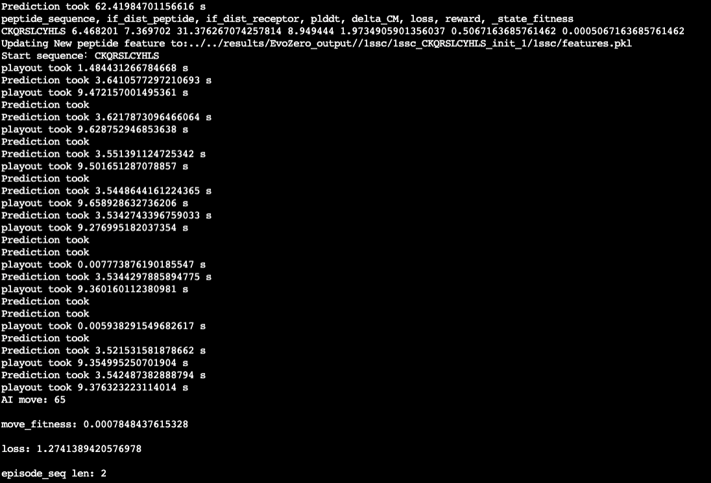
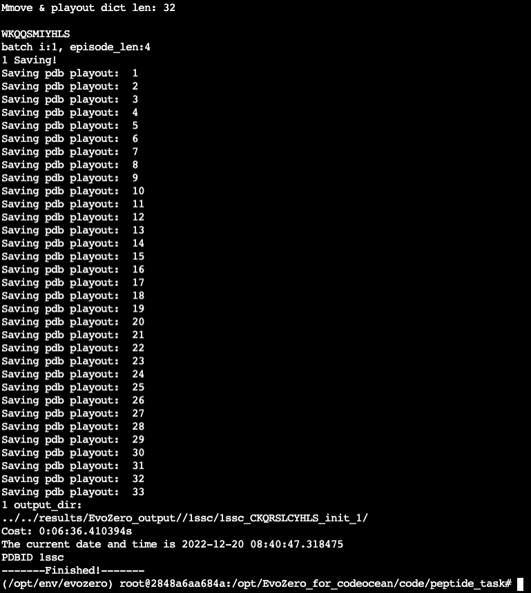

# EvoZero

This repository contains code and tutorials for protein sequence design task from MGI-X, including ***Peptide binders design with MCTS-assisted AlphaFold*** and ***MCTS-assisted directed evolution***

+ Citation

```
@article{Licko2022evozero,
  title={Self-play reinforcement learning turbocharges protein engineering},
  author={Yi Wang, Hui Tang, Lichao Huang, Lulu Pan, Lixiang Yang, Ming Ni, Huanming Yang, Feng Mu, Meng Yang},
  journal={xxxx},
  doi={xxxx},
  url={x x x},
  year={2022},
  publisher={xxxx}
}
```


## Requirement

+ Ubuntu18.04
+ GPU: NVIDIA A40 or NVIDIA RTX6000
+ python=3.8.10, cuda11.3, cudnn=8.4.1

Detail in ./environment/evozero_binderdesign_env_py38_cuda11.yml

```shell
### conda env export > evozero_binderdesign_env_py38_cuda11.yml

dependencies:
  - cudatoolkit=11.3.1=h2bc3f7f_2
  - cudnn=8.4.1.50=hed8a83a_0
  - numpy=1.23.1=py38h6c91a56_0
  - numpy-base=1.23.1=py38ha15fc14_0
	...
  - python=3.8.10=hb7a2778_2_cpython
  - python-dateutil=2.8.2=pyhd3eb1b0_0
  - pytorch=1.12.1=py3.8_cuda11.3_cudnn8.3.2_0
  - pytorch-mutex=1.0=cuda
  - tensorflow-estimator=2.7.1=cuda112py38hf5dcc89_0
  - tensorflow-gpu=2.7.1=cuda112py38h0bbbad9_0
	...
  - pip:
    - chex==0.0.7
    - contextlib2==21.6.0
    - dm-haiku==0.0.4
    - dm-tree==0.1.7
    - etils==0.8.0
    - immutabledict==2.0.0
    - jax==0.3.13
    - jaxlib==0.3.10+cuda11.cudnn82
    - logomaker==0.8
    - ml-collections==0.1.0
    - pandas==1.5.0
    - py3dmol==1.8.1
    - pytz==2022.4
    - pyyaml==6.0
    - seaborn==0.12.0
    - svgwrite==1.4.3
    - tabulate==0.9.0
    - toolz==0.12.0
    - tree==0.2.4
```

# Getting started

In the first step, you will need to download parameters&datasets to run each notebook and reproduce the result. The download links for datasets are shown in a folder named "data" in the following tasks directories.

## Step1: Clone this repository and cd into it.

```shell
mkdir your_workspace
cd your_workspace
git clone https://github.com/melobio/EvoZero
```

## Step2: Download parameters

+ Download alphafold params from [AlphaFold Github](https://github.com/deepmind/alphafold/blob/main/scripts/download_alphafold_params.sh)

```shell
cd ./code/Peptide_task/AF/
bash download_alphafold_params.sh ./
```

+ After clone this repository, you can get the data of specific task from folder named  `"data"`

```shell
ls -l ./data
```


## Step2: Pull Docker image or Local Installation

Configure the environment or use the docker image. You can deploy the EvoZero environment in two ways:


1. Pull EvoZero Docker image

The docker image has a total size of 24GB, including the alphafold parameter file (3.5GB), the complete conda environment evozero, cuda11.5 and cudnn8 with Ubuntu18.04, and we will provide dockerfile versions and smaller versions later.

```shell
# Old docker images, size about: 24.3GB, only for peptide_task
docker pull licko789/evozero:peptide

# New docker images, size about: 29.2GB, for all evozero task
docker pull licko789/evozero:latest
```

And then, launch EvoZero docker image and enter the container interactively.

in the folder `your_workspace`, 
```shell
# Launch EvoZero docker image
nvidia-docker run \
  -it -rm licko789/evozero:latest \
  -v /your_workspace:/docker_workspace \
  /bin/bash
```


2. Install environment locally in Ubuntu

```shell
conda create -n evozero python=3.8 -y
source activate evozero
conda update -n base conda -y
conda install cudnn==8.2 cudatoolkit==11.3 -y 
conda install -c conda-forge openmm==7.5.1 pdbfixer matplotlib
# install alignment tools
conda install -c conda-forge -c bioconda kalign3=3.2.2 hhsuite=3.3.0 -y
conda install -y nb_conda scikit-learn biopython

# install jax. note: jax beyond 3.16 does not apply to AF2.0
pip install https://storage.googleapis.com/jax-releases/cuda11/jaxlib-0.3.10+cuda11.cudnn82-cp38-none-manylinux2014_x86_64.whl
pip install jax==0.3.13

# install pytorch and tensorflow-gpu
conda install pytorch torchvision torchaudio cudatoolkit -c pytorch -y
conda install tensorflow-gpu=2.7

pip install seaborn logomaker tree dm-tree py3Dmol
pip install chex==0.0.7 dm-haiku==0.0.4 immutabledict==2.0.0 ml-collections==0.1.0

# Added, support for gluc, gfp and other tasks of evozero
pip install openpyxl tape-proteins xlrd==1.2.0

```

## Step3: Execute specific task

EvoZero is used for four missions, and you can see the four mission code directories in the Code directory：
+ GB1_PhoQ_task
+ GLuc_design_task
+ PAB1_GFP_task
+ Peptide_task


# EvoZero Peptide Design Task

We used the MCTS strategy with AlphaFold as a predictor for the design of receptor protein-polypeptide complexes. Main code In EvoZero/code/peptide_manuscript/: 

+ Main
  - ./evozero_peptide_expand_m_p.py

- AlphaFold simulated environment
  - ./sequence_env_alphfold_expand_m_p.py

+ Optimizer
  - ./mcts_alphaZero_mutate_expand_m_p.py

The output files are: the new polypeptide sequence designed by EvoZero, the plddt score corresponding to the sequence, the loss result, the 3D structure file of the peptide, and the hyper-parameters of the EvoZero-peptide model.

+ Output dir

  + EvoZero/output/EvoZero_output/[PDBID]/[PDBID]_xxxx_init_1_playout22

    + sequence.npy

    + plddt.npy

    + loss.npy

    + unrelaxed_[xxx].pdb

    + commandline_args.txt

## USAGE
It supports optimal peptide design under playout loss and move loss, AlphaFold feature extraction and intermediate feature preservation.

You can run it In your local conda environment

```shell
source activate evozero
cd EvoZero/code/Peptide_task
bash ./Run_manustript_design.sh
```

In addition，we also provide a complete docker image for users to use:

```shell
# pull docker images
docker pull licko789/evozero:peptide
nvidia-docker run -it --name demo -v /your_workspace/:/workspace licko789/evozero:peptide /bin/bash

# Run
# NITER=2
conda activate /opt/env/evozero
cd /opt/EvoZero_for_codeocean/code/peptide_task/
bash Run_manustript_design.sh
```

And then you can find your result in `EvoZero/results/EvoZero_output`.

The output files are: the new polypeptide sequence designed by EvoZero, the plddt score corresponding to the sequence, the loss result, the 3D structure file of the peptide, and the hyper-parameters of the EvoZero-peptide model.

+ Output dir

  + EvoZero/output/EvoZero_output/[PDBID]/[PDBID]_xxxx_init_1_playout22

    + sequence.npy

    + plddt.npy

    + loss.npy

    + unrelaxed_[xxx].pdb

    + commandline_args.txt









# EvoZero-PAB1_GFP_task

Main code In EvoZero/code/PAB1_GFP_task/: 

+ Main
  - ./train_m_single_m_p_pab1.py
- Evaluation
  - ./evaluation_by_oracle.py

## Usage


## Getting started

In this task, We train our EvoZero on two protein dataset(PAB1、GFP) and generate new sequences. to perform this task，we just need two steps:


### Step1: Generate new sequences by using the below command:


```shell
source activate evozero
cd EvoZero/code/PAB1_GFP_task
python train_m_single_m_p_pab1.py
```

After runing this command,the generated sequences will be stored in the evozero_pab1_generated_sequence_1.csv,we can use the oracle landscape to evaluate the quality of the generated sequences.


### Step2: evaluate generated sequences by using the below command:

```shell
python evaluate_by_oracle.py
```

After runing this command,the result will be displayed on the output screen.


# GLuc design task 
GLuc design task corresponds to Gaussia luciferase engineering in the manuscript 

## Runing 
- Run *active_gp_gluc.py* one time to generate 150 designed Gluc sequences. In the manuscript, the process is run with 10 repeats. The design results will be stored in */code/GLuc_design_task/output_design* folder. 
 
The model input files in */code/GLuc_design_task/input_file* are processed from *5-Gluc突变体位点信息.xlsx* in folder*/data/GLuc_design_preprocess_data/in_house_variant_preprocess*, and all Intermediate files generated during the preprocessing are in this folder. See *gluc_data_process.ipynb* for details of preprocessing.

# EvoZero-assisted directed evolution 
GB1_PhoQ_task corresponds to "EvoZero-assisted directed evolution" task in the manuscript.

## Running 
### Generate training data
- Run *active_gp.py* to generate 500 repeats of 384 designed sequences for the following supervised training procedure. The 500 output files of every 384 generated sequences will be stored in */code/GB1_PhoQ_task/output_384_training_seqs/GB1* or */code/GB1_PhoQ_task/output_384_training_seqs/PhoQ* folder.   

### Evaluation
An whole 500 repeats of completely generated training sequences are stored in */data/GB1_PhoQ_data/results/GB1_384trainingSeqs_500repeats_30simulatin* folder,and their supervised training results are in folder*/data/GB1_PhoQ_data/results/GB1_mlde_supervised_output*, which are computed using the code of ftMLDE(https://github.com/fhalab/MLDE). 
- Run *mean_max_3.py* to calculat "Global maximal fitness hit count","Predicted max fitness","Predicted mean fitness" metrics, 
- Run *local_max_hit.py* to see the local peaks count. 


# Notebook

> Doing...


This script was used to design peptide.

+ EvoZero/code/Peptide_task/Run_manustript_design_jupyter.ipynb

~~This script was used to compare the effects of EvoZero in different peptides.~~

- ~~EvoZero/code/Peptide_task/EvoZero_analysis.ipynb~~

